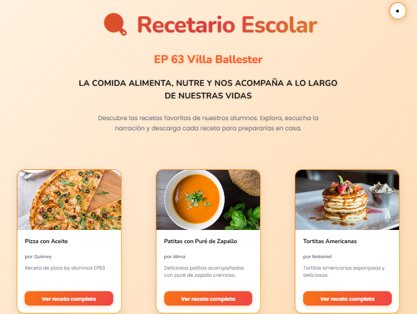

# 🍽️ Recetario EP 63 - Villa Ballester

Bienvenidos al **Recetario del Colegio EP 63 de Villa Ballester**, realizado con mucho cariño por los chicos y sus familias.  
Este proyecto reúne recetas, historias y sabores que nos unen en torno a la comida y la compañía.

---

## ✨ Mensaje especial

> **"LA COMIDA ALIMENTA, NUTRE Y NOS ACOMPAÑA A LO LARGO DE NUESTRAS VIDAS.  
> TAMBIÉN ES FAMILIA, COMPAÑÍA, AMISTAD, AMOR Y UNIÓN.  
> GRACIAS POR COMPARTIR."**

---

## 📷 Imagen del proyecto

---

## 📖 Sobre el proyecto
- 🏫 Colegio: **EP 63 Villa Ballester**
- 👩‍👩‍👧‍👦 Participantes: **Chicos y familias**
- 💡 Objetivo: **Compartir recetas, historias y momentos especiales a través de la comida**

---

## 💌 Agradecimientos
A todos los que aportaron sus recetas, tiempo y cariño para hacer este recetario posible.  
¡Gracias por ser parte de este hermoso proyecto! 🧡
